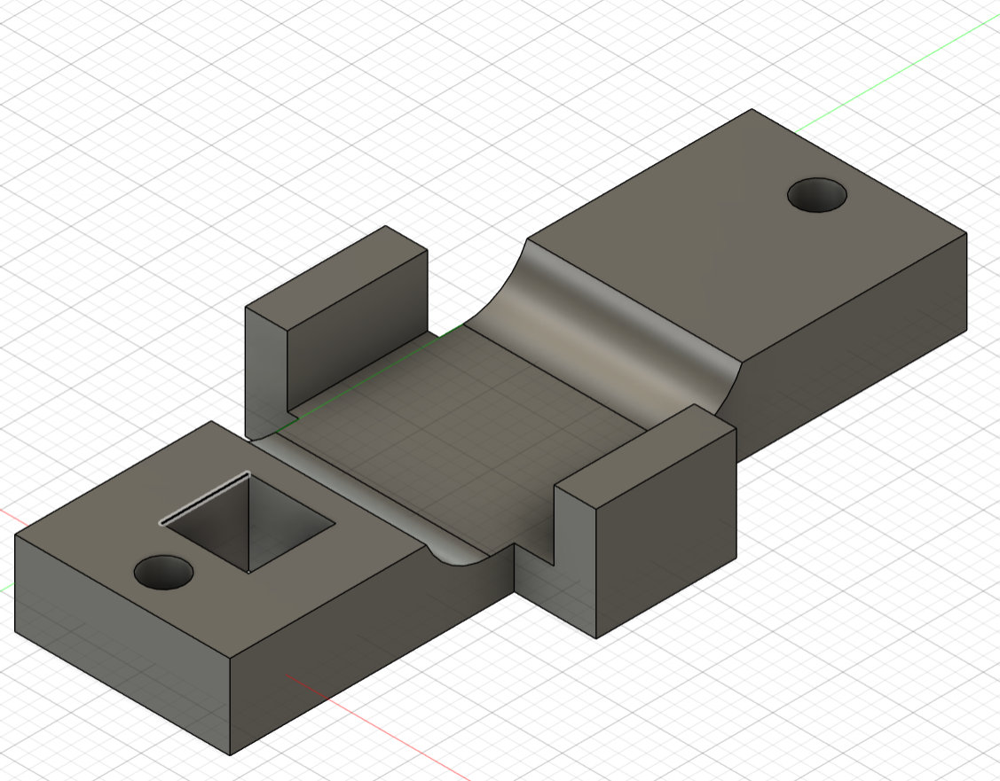
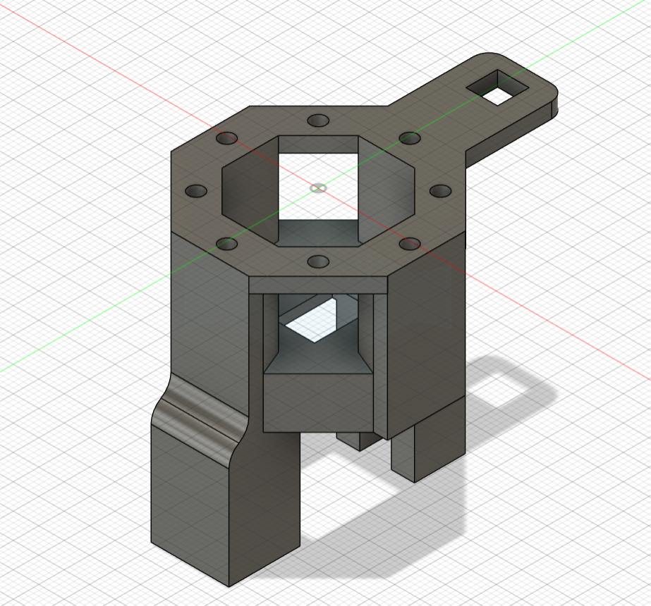
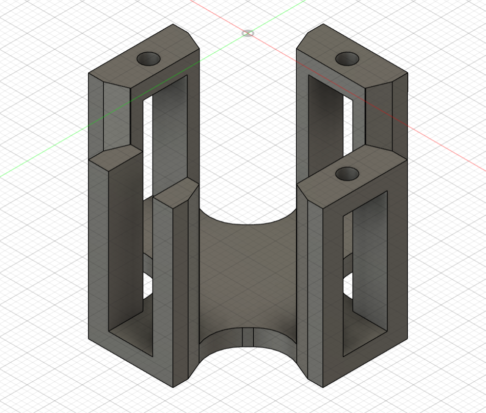
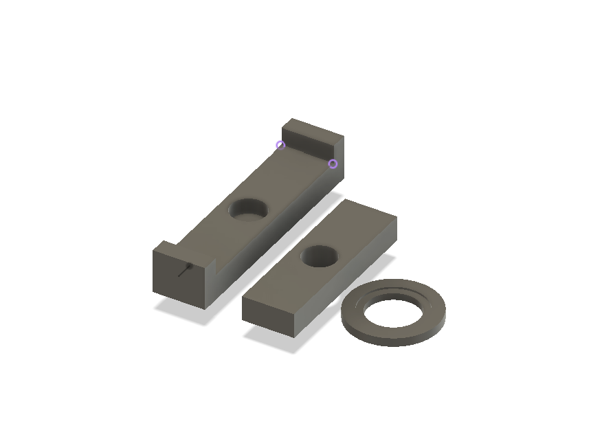
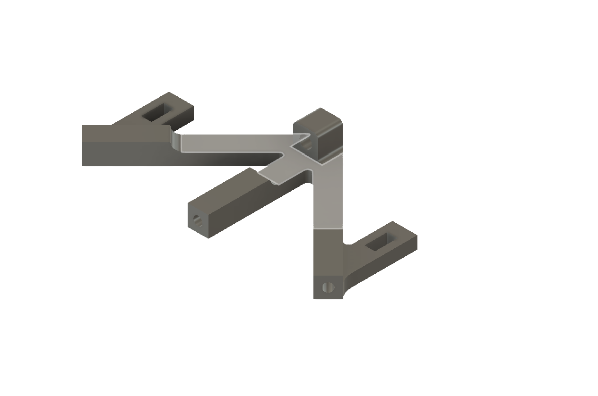
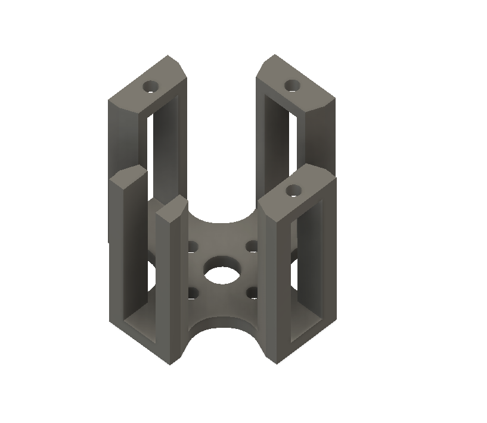
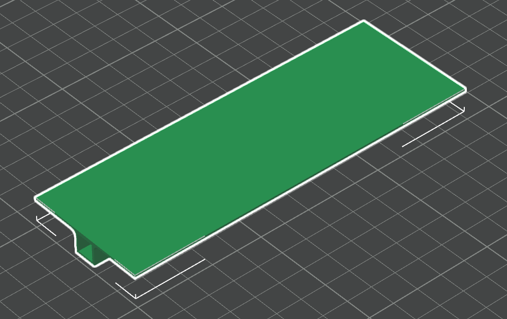

# Flapping Wing Robot (FWR) Prototype CAD Files
This repository contains the cad files for the flapping wing robot from IIIT Hyderabad.

### Below are the CAD files

---

-   **Front Bracket**: [Link](cad/final_front_bracket/)
    
	

-   **GBM**: [Link](cad/final_gbm/)
   
    

-   **GPS Mount**: [Link](cad/final_gps_mount/)
    
	

-   **Motor Guard**: [Link](cad/final_motor_guard/)
    
	

-   **T-Joint**: [Link](cad/final_t_joint/)
    
	

-   **T1**: [Link](cad/final_t1/)
    
	

-   **T2**: [Link](cad/final_t2/)
    
	

-   **Tail Holder**: [Link](cad/final_tail_holder/)
    
	

-   **Tail Triangle**: [Link](cad/final_tail_triangle/)
    
	

-   **Wing**: [Link](cad/final_wing/)
    
	

-   **Ball Tail**: [Link](cad/final_ball_tail/)
   
    

-   **Component Holder Offset**: [Link](cad/component_holder_offset/)
    
	

-   **Electronic Component Holder**: [Link](cad/electronic_component_holder/)
    
	

---