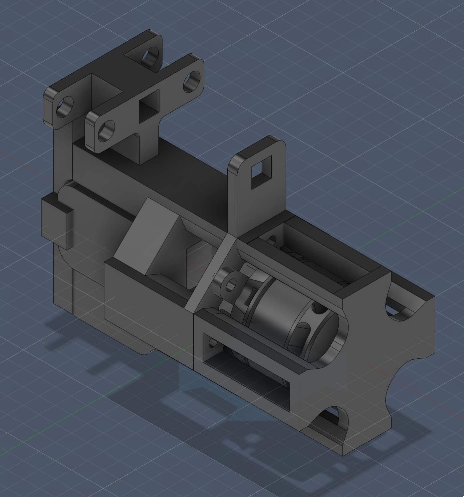
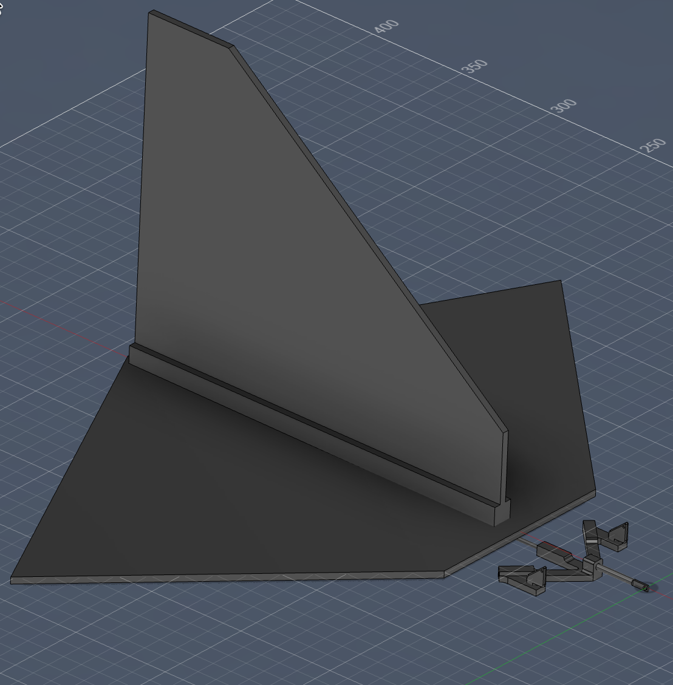

# Flapping Wing Robot (FWR) Prototype CAD Files

This repository contains CAD files for the flapping wing robot from IIIT Hyderabad.

## Main Components Built Till Now

- **Fuselage Bottom**
	- CAD: [assembled/subsys/Fuselage/Bottom/Fuselage - Bottom.f3d](assembled/subsys/Fuselage/Bottom/Fuselage%20-%20Bottom.f3d)
	- Screenshot:


- **Fuselage Top**
	- CAD: [assembled/subsys/Fuselage/Top/Fuselage - Top.f3d](assembled/subsys/Fuselage/Top/Fuselage%20-%20Top.f3d)
	- Screenshot:


- **Propulsion Subsection**
	- CAD: [assembled/subsys/Propulsion/Front subsection.f3d](assembled/subsys/Propulsion/Front%20subsection.f3d)
	- Screenshot:



- **Tail Subsystem**
	- CAD: [assembled/subsys/Tail/Tail.f3d](assembled/subsys/Tail/Tail.f3d)
	- Screenshot:



## Assembled Folder Structure

```text
assembled/
	mjx_subsys/
		Propulsion/
		Tail/
			Tail.f3d
	subsys/
		Fuselage/
			Bottom/
				Fuselage - Bottom.f3d
			Top/
				Fuselage - Top.f3d
		Propulsion/
			Front subsection.f3d
		Tail/
			Tail.f3d
		Wings/
	whole_build/
```